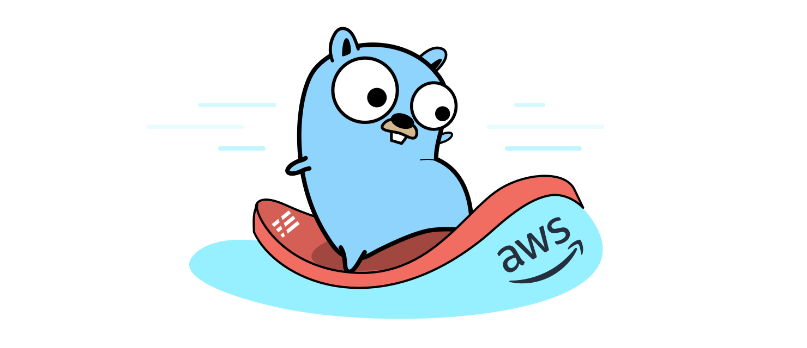

## Continuous integration  with Codebuild and ECR for Golang APIs


<p align="center">
  
</p>


this is a minimal API to get books information and their Continuous integration workflow with Codebuild and ECR 


***Run Golang API:***

for running the golang api please, run the follow command, this API open the 8080 Port:

```console
go run *.go
```

***Build Docker image***

for building the docker image, run the follow commands:

```console 
docker build -t libraryapi .
```

***Make the Codebuild and ECR:***

add the needed variables to terraform.tfvars and run *terrafom plan* and *terraform apply*


